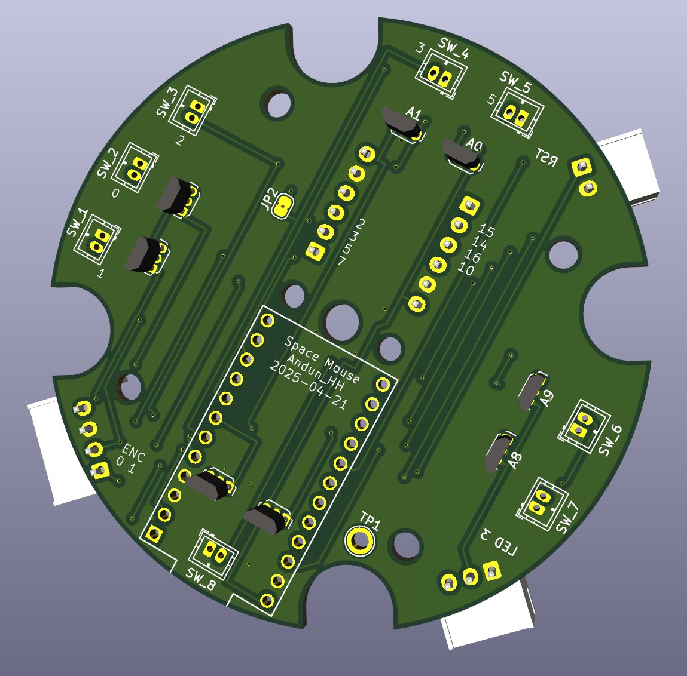

# Hall-Effect-PCB
Repo to store PCB files for the hall effect sensor space mouse 

This repo is based on the work by Michael Roth:
https://www.printables.com/model/1063960-cad-mouse-spacemouse-using-hall-effect-sensors-w-p

Open the file in KiCad.

## Modifications
Added connectors for possible connection of keys, encoders and LEDs. The actual housing do not fit in a close space mouse, but it's fine for a first test or to solder the wires directly. 

Here a 3d rendering:

### Key Connector 1
16, 14, 15, 10 + GND + VCC 

### Key Connector 2
5, 7, 2, 3 + GND + VCC
(3 is doubled with LED!) -> solder connection point

### Encoder
VCC, GND, 0, 1

### LED strip
GND, VCC, 3  (3 is doubled with key!) -> solder connection point

# Part Library
This project uses the arduino pro micro KiCad part library by Biacco42:

https://github.com/Biacco42/ProMicroKiCad

Therefore it is included as a git submodul.

Please run `git submodule update --init` after cloning this repo in order to populate the folder on your disk.

# License 
Creative Commons License  

This work is licensed under a Creative Commons (4.0 International License)

Attribution—Noncommercial—Share Alike